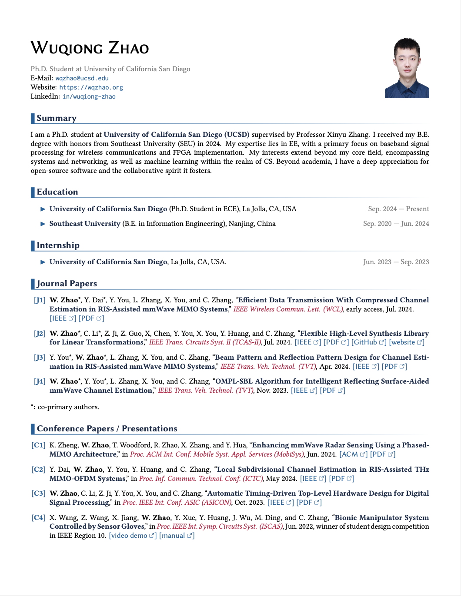
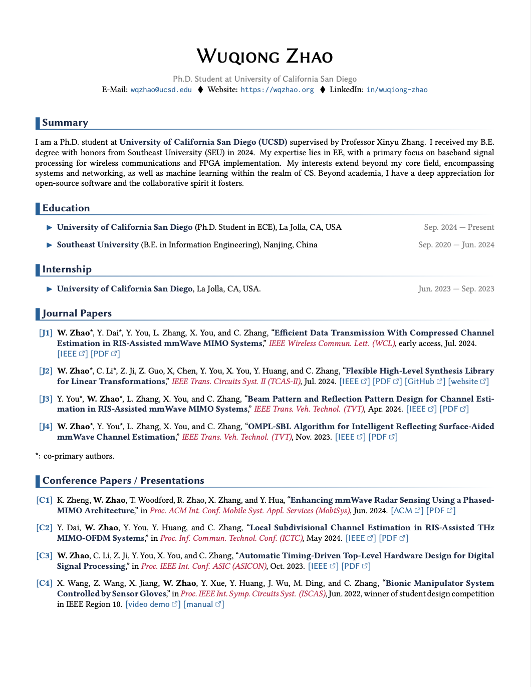

# `color-cv`: LaTeX Template for Colorful CV
A modern and colorful LaTeX template for CV.

- [x] Modern and colorful design
- [x] Optional contact information
- [x] Easy to customize (colors, fonts, etc.)
- [x] Ready-to-use example CV
- [x] Fully open-source (LPPL license)

## Demo
Different header styles are available based on whether a photo is included.

<table>
  <tr>
    <th style="text-align:center;">With Photo</th>
    <th style="text-align:center;">Without Photo</th>
  </tr>
  <tr>
    <td style="text-align:center;" width=50%></td>
    <td style="text-align:center;" width=50%></td>
  </tr>
</table>

View [PDF on *wqzhao.org*](https://go.wqzhao.org/cv).

## Usage
The LaTeX engine for `color-cv` is **LuaLaTeX**.
It can also work with XeLaTeX.

[`color-cv.tex`](color-cv.tex) is an example CV of [Wuqiong Zhao](https://wqzhao.org),
which can be used as a template for your own CV.

### Contact Information
The contact information can be optionally included in the CV, including:
- Phone (`\phone`)
- Email (`\email`)
- Website (`\website`)
- LinkedIn (`\linkedin`)
- Photo (`\photo`)

You can also set a brief introduction about yourself using `\brief`.

### Customization
#### Paper Size
By default, the paper size is set to US Letter.
Use option `paper = a4` in the document class to change it to A4 size.
For example:
```latex
\documentclass[paper = a4]{article}
```

#### Colors
The theme color can be easily customized by changing the color definition in the preamble.
For example:
```latex
\renewcommand \ThemeColor     {brown}
\renewcommand \ThemeColorDark {brown!50!black}
\renewcommand \CiteColor      {blue}
```

#### Fonts
By default, the font is set to use the `libertine` font.
Alternatively, `lmodern`, `times`, `palatino` are available.

The mono font is set to use `Inconsolata`.

## License
This project is open-source under the [LPPL license](LICENSE).
